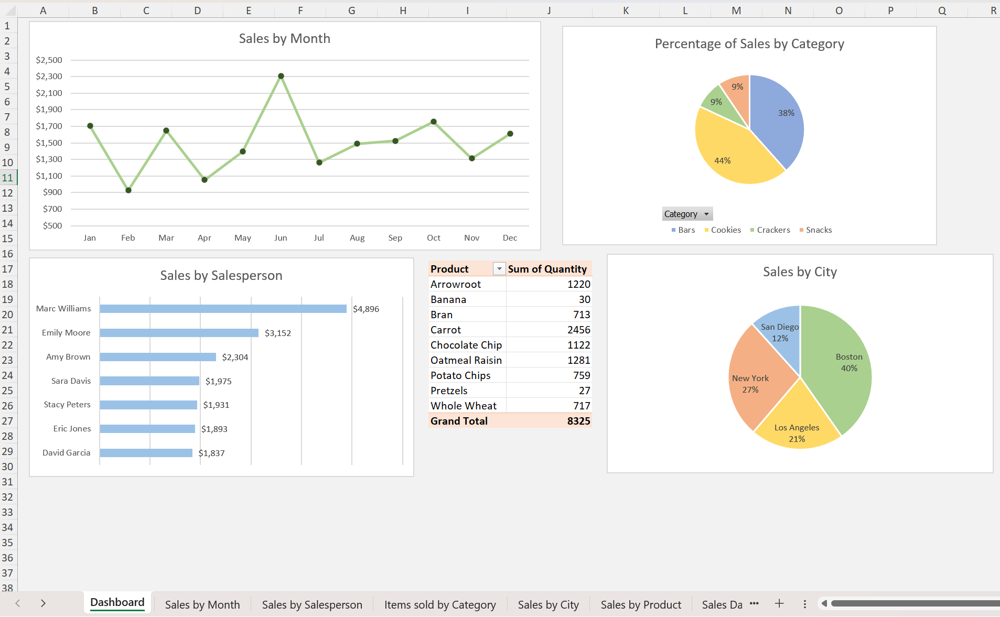
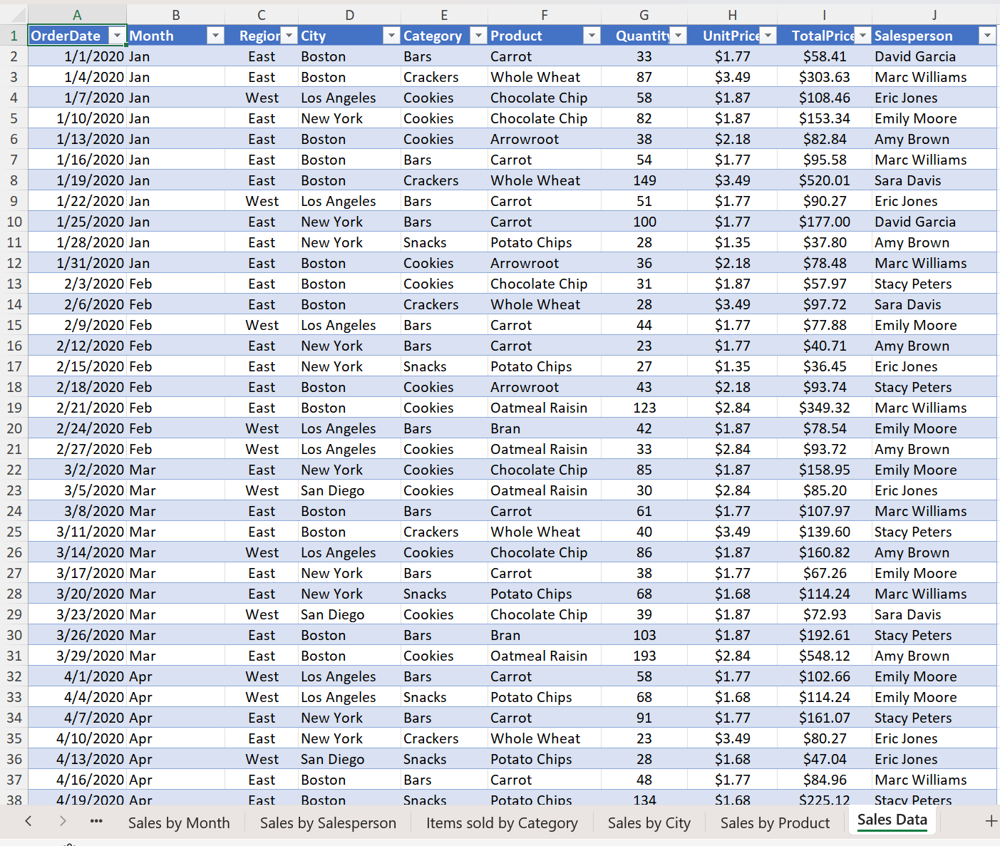
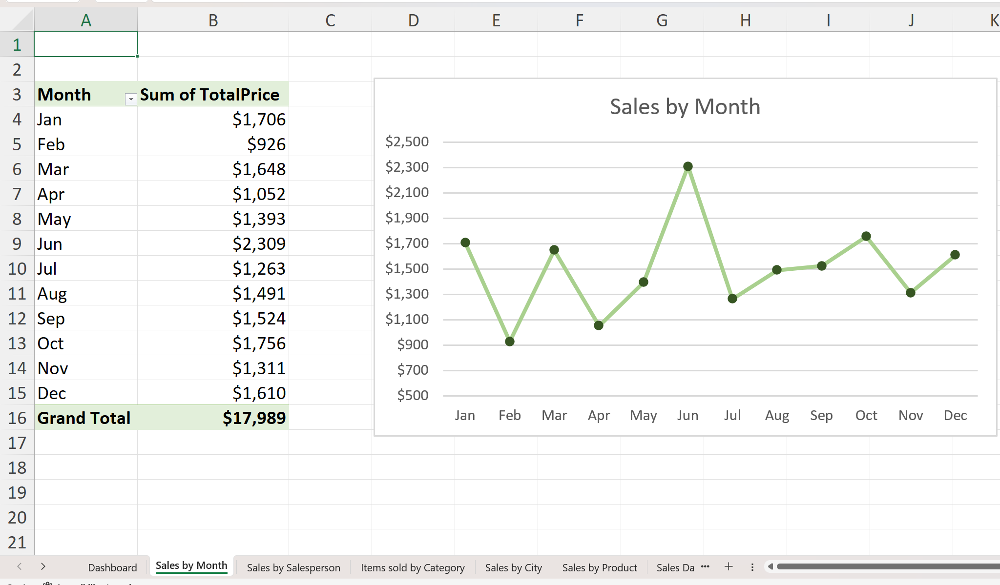
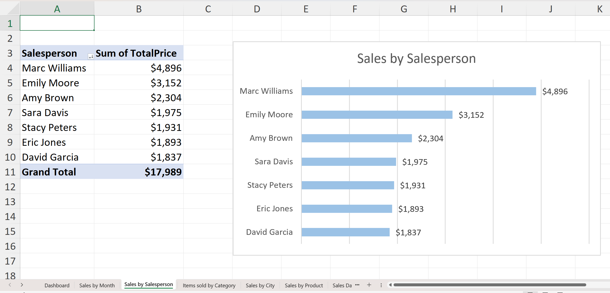
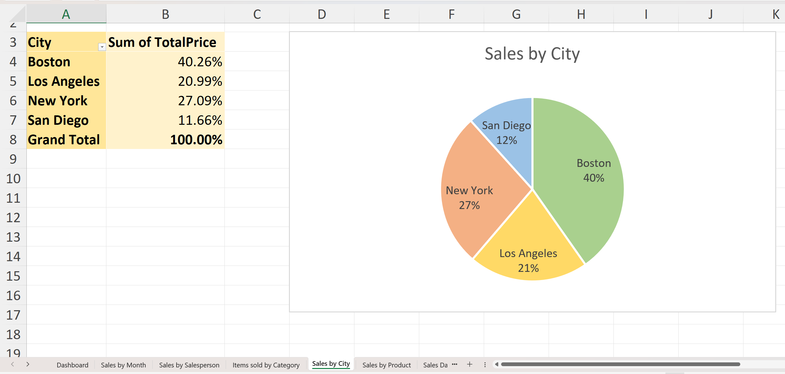
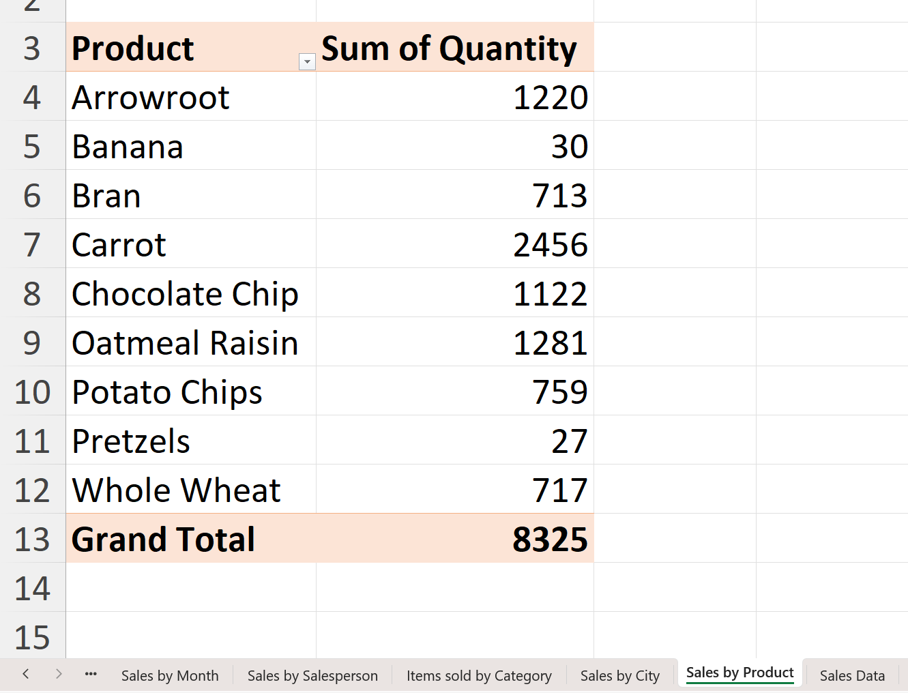

# Sales Data Analysis & Excel Dashboard

## Excel Sales Dashboard

## Project Overview

This project analyzes **retail sales data** using **Microsoft Excel** to transform raw transactional records into meaningful business insights and an interactive dashboard.

The complete workflow followed in this project:

**Raw Data → Data Cleaning → Pivot Tables → Pivot Charts → Dashboard → Business Insights**

The focus of this project is on **data preparation, analysis, and visualization using Excel**.

---

## Raw Sales Data Structure

The dataset contains transactional records with the following columns:

| Column       | Description                          |
|--------------|--------------------------------------|
| OrderDate    | Date of order                       |
| Month        | Extracted month from OrderDate      |
| Region       | East / West                         |
| City         | Sales city                          |
| Category     | Product category                    |
| Product      | Product name                        |
| Quantity     | Units sold                          |
| UnitPrice    | Price per unit                      |
| TotalPrice   | Quantity × UnitPrice                |
| Salesperson  | Responsible salesperson             |

---

## Dashboard Views

The Excel dashboard provides the following analytical views:

- **Sales by Month**

- 

- **Sales by Salesperson**

- 

- **Percentage of Sales by Category**

- 

- **Sales by City**

- 

- **Sales by Product (Quantity)**

- 

---

## Tools Used

- Microsoft Excel
- Data Cleaning Techniques
- Calculated Columns
- Pivot Tables
- Pivot Charts
- Dashboard Design

---

## Skills Demonstrated

- Working with raw transactional data
- Creating calculated metrics (TotalPrice)
- Pivot-based analysis
- Visual storytelling using dashboards
- Generating actionable business insights

---

## Outcome

This project simulates a real-world business scenario where raw sales data is transformed into a structured dashboard to help decision-makers understand:

- Sales trends over time
- Top-performing products and categories
- Regional and city-wise performance
- Salesperson effectiveness
